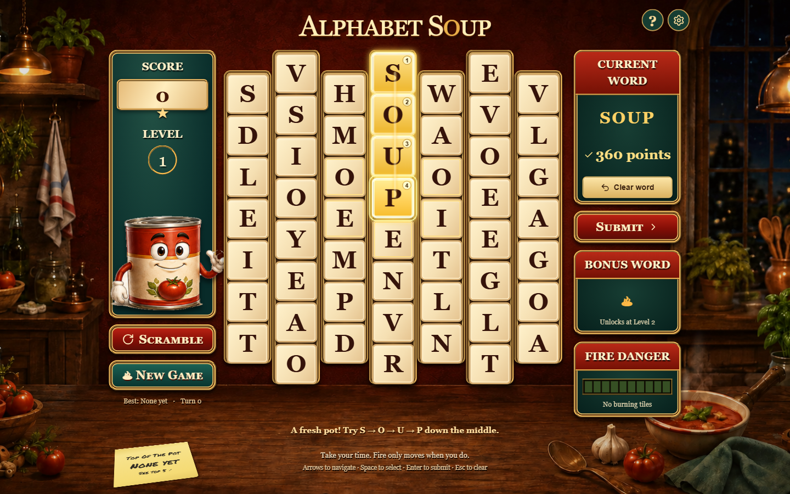
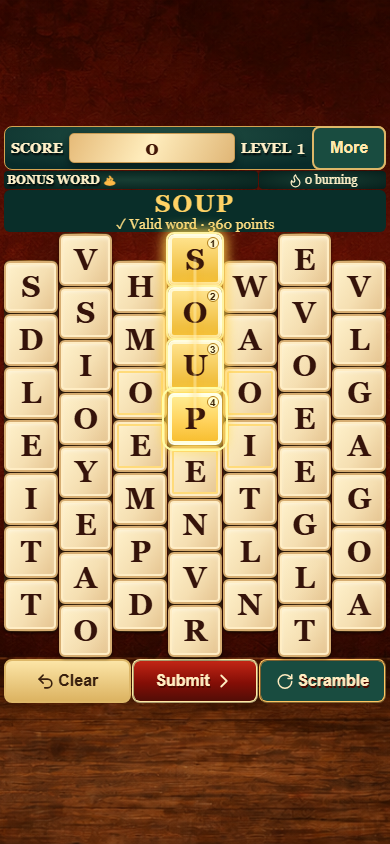

# Alphabet Soup

**Make words. Earn colorful rewards. Keep the soup from boiling over.**



<p align="center">
  
  <br />
  <em>The same game, arranged for one-handed phone play.</em>
</p>

**[Play Alphabet Soup](https://jimerb.github.io/Alphabet-Soup/)** · **[How to play](docs/HOW_TO_PLAY.md)** · **[Scoring reference](docs/HOW_TO_PLAY.md#scoring)** · **[Run locally](#run-locally)**

Alphabet Soup is a turn-based word game in a cozy kitchen. Connect neighboring
letters on a staggered, 52-tile board, build longer words to earn special tiles,
and clear burning letters before they reach the bottom. There is **no timer**:
the challenge is deciding which word will score well and leave the board in a
better state for your next move.

Play with a mouse, touch, or keyboard. Desktop gives the board and score panels
room to breathe; the phone layout keeps the board, selected word, and play
buttons together. The screenshots show the same opening word, **SOUP**, selected
in the actual game at desktop and phone viewport sizes.

## Your first word

1. **Connect at least three neighboring letters.** Click, tap, or drag through tiles that touch along the staggered board. Each tile can appear only once in a word. Try the opening **SOUP** down the center column.
2. **Look at the preview, then Submit.** A valid word shows its score before you play it. Used letters disappear, the rest fall down, and new letters arrive from above. Invalid attempts cost no turn.
3. **Use longer words to earn rewards.** Five letters earn Green, six Gold, seven Sapphire, and eight or more Diamond. Include those colored tiles in later words to boost your score.
4. **Keep an eye on red tiles.** Fire burns downward after accepted moves. Clear burning letters in a word; once fire reaches the bottom, your next valid word must remove every bottom fire to keep the game alive.

Change your mind for free: select an earlier tile to trim the word back to it,
select the last tile to undo it, or use **Clear**. **Scramble** mixes letters but
costs a turn and advances fire, so use it carefully.

Every **10,000 points** advances a level. From Level 2, work toward an exact bonus
word for an extra award. **Top Of The Pot** records your five best runs as you
play. For all letter values, colored-tile boosts, fire rules, and keyboard
controls, read the **[complete playing guide](docs/HOW_TO_PLAY.md)** or open **?**
in the game (**More → How to Play & Scoring** on a phone).

## Pick up where you left off

Your board, score, bonus target, and even your unfinished word save automatically
in the same browser when saving is available. Reopen the game to continue.
Settings include separate music and sound effects controls, reduced motion,
and high contrast.

**No account, database, or persistent backend is required.** Progress and high
scores stay on your device. They do not sync between browsers or phones, and
clearing site data or ending a private-browsing session may erase them. If the
game shows a save warning, keep the tab open: that run may not survive a reload.

## Technical overview: static hosting, browser-local storage

The production game is a **static site**. Gameplay, scoring, dictionary checks,
and save handling run in the browser; there is no persistent backend, game
server, database, or sign-in service to operate. The dictionary and assets are
served with the site, without an external word-lookup API.

Game state is stored in the browser’s **localStorage** (persistent browser site
storage, rather than the disposable HTTP asset cache). The versioned
`alphabet-soup-save` record holds the current run and local leaderboard; settings
are stored locally too. On a secure origin such as HTTPS or localhost, Web Locks
and revision checks protect saves from stale tabs. Browsers without Web Locks
use memory-only play with a visible warning.

This makes static hosting convenient, but does **not** add cloud sync or guarantee
offline loading. See the persistence details below for recovery behavior.

## Run locally

Requires Node.js 22.13 or newer and pnpm. Run these commands from the `game` directory (the repository root):

```sh
pnpm install
pnpm dev
```

Open **http://localhost:3000/**. The preview also listens on your local network;
phones on the same network can use `http://<your-computer-LAN-IP>:3000/`.
Plain LAN HTTP cannot use Web Locks, so the game displays a warning and keeps
that preview run in memory only. Use HTTPS hosting for durable phone saves.

```sh
pnpm test   # complete automated suite
pnpm build  # static export to dist/client
```

Serve `dist/client` with a static host. The included GitHub Pages workflow builds
with `NEXT_PUBLIC_BASE_PATH=/Alphabet-Soup` and deploys that directory. Local
development tools do not need to run on the production host.

## Architecture

- `lib/game/engine.js`: seeded randomness, board geometry, trie dictionary, scoring, turn phases, gravity, fire, rewards, bonus words, and scramble.
- `app/how-to-play.jsx`: structured help with letter values and reward boosts sourced from the engine.
- `lib/game/persistence.js`: browser-local checkpoints, recovery, and protection against stale tabs.
- `app/page.jsx`: accessible pointer/keyboard controller, phase playback, character reactions, audio, settings, dialogs, and WebMCP actions.
- `app/globals.css`: brass and ivory kitchen presentation, staggered geometry, responsive layout, fire and falling animation.
- `public/assets`: background and individually cropped character sprites; source uploads remain in the parent workspace.

## Rules & dictionary

`BALANCE`, `VALUES`, `TIERS`, and `CAPACITIES` in the engine define the rules.
Generation uses seeded randomness. New games place the adjacent word **SOUP**
in the center column for an approachable first move. The in-game letter and
reward references read their values directly from the engine.

Dictionary: bundled `sindresorhus/word-list` list, downloaded 2026-09-05, alphabetic entries of at least three letters, case-insensitive. Source: [sindresorhus/word-list](https://github.com/sindresorhus/word-list). Its MIT license is retained in `public/DICTIONARY-LICENSE.txt`. Common nouns that also happen to be names (for example john and terry) remain valid in their ordinary-word sense. Repeated words and listed inflections are allowed; punctuation forms and proper-name-only entries are not intentionally included. Vocabulary is broad, including uncommon words. No network lookup is needed once the dictionary loads from the game's own files.

## Sound & presentation

Music and effects have separate volume and mute controls. Effects default to 55%. Sound only initializes on user interaction. Reduced motion follows the system on first visit; local overrides and best score persist on the same browser. Active runs and unfinished selections automatically resume on reload.

The score counts up with quiet ticks, and falling letters have a short crouton-like landing and bob. Clear word is a prominent button with a 44px minimum target. Fire damage has a subtle singe; completing the exact bonus word plays a reward chime. A fatal bottom fire plays the supplied `LosingHorn.m4a`. All effects follow the effects volume and mute controls, separately from music. Muting or restarting stops the horn; Reduced motion makes score changes and tile placement immediate.

Hot tiles carry two subtle smoke wisps. A dedicated foreground layer keeps steam above every board column. The emitter moves with the tile, softens during falling and scrambling, disappears with cleared tiles, and is hidden by Reduced motion.

## Save format & recovery

Top Of The Pot and the current game share one versioned localStorage record (`alphabet-soup-save`). Completed moves are saved before animation playback; each run has one permanent ID, so improvements replace its own leaderboard entry even after reopening. The complete board, score, level, bonus, fire conditions, turn, seed, tile counter, selected path, and keyboard focus resume automatically. Finished games retain their final board; New Game replaces the checkpoint while keeping earned scores. Dates retain the local calendar day of the achievement and existing tie ordering.

The first save imports real dated entries from `alphabet-soup-high-scores`, leaving that legacy key untouched for recovery. Damaged boards are discarded while valid leaderboard entries survive. Unknown save versions remain untouched. Storage failures keep play available with a persistent warning and retry on the next change. Web Locks plus revisions prevent a stale tab from replacing newer progress; on conflict the latest game is restored and the action must be retried. Browsers without Web Locks use memory-only play with a warning. Browser/profile/site changes do not transfer saves; clearing site data and ending private browsing may remove them. This feature does not add offline loading or cloud syncing. The marker font is bundled with its license in `public/fonts`.

## Reproducible development sessions

Developer fixture: in local development, open `/?fixture=mockup` for the exact reference letters and reward positions, including damaged diamond and urgent bottom red S. `/?seed=123` reproduces a starting seed. Production ignores the developer fixture. Explicit seeded sessions and the development fixture neither read nor write the normal game save or leaderboard.

## Verification

### Phone play

Touch-capable screens below 600 CSS pixels use a phone layout: score and level,
bonus/fire information, the complete current word above all 52 tiles, and Clear,
Submit, and Scramble below. More opens a paused bottom sheet for settings, help,
high scores, turn information, and New Game. Existing desktop and normal tablet
layouts retain their original sizing.

Phone tiles target 44–52px height, with a 40px minimum in short browser windows;
action buttons stay at least 44px tall. Portrait is primary. Landscape below
1000px wide and 500px tall uses a board-and-controls arrangement when it fits;
otherwise an upright-phone prompt preserves the game and selection. Browser
zoom remains enabled. Sound resumes on the next interaction after suspension
or Safari interruption, retaining the existing volume and mute preferences.

Supported sizing targets start at 360px-wide Android phones and second/third
generation iPhone SE or larger. Real-device Safari/Chrome audio, browser chrome,
and lock-screen interruption checks remain part of release acceptance; see the
latest entry in `VERIFICATION.md`.

The automated suite covers 100 simulated accepted moves, fixed board capacities, adjacency, invalid-action immutability, downward compaction, reward damage, response turns, stacked fire, new-fire delay, scramble, scoring, bonus progression, leaderboard persistence, phone sizing, pointer ownership/cancellation, and audio interruption/mute/reset behavior. Run `pnpm test` for the complete suite. Browser checks and delivery details are recorded in `VERIFICATION.md`.
